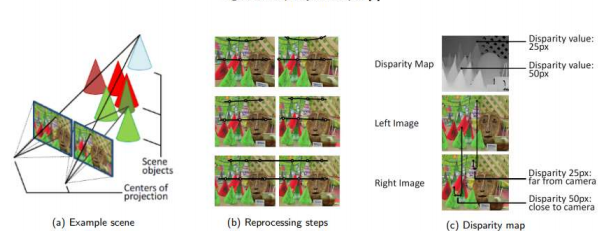

# Advanced-Vision-Motion-and-Image-Analysis-
Advanced Vision, Motion and Image  Analysis Excercises

### Camera Calibration and Image Rectification
The camera intrinsic matrix A is composed of the focal lengths fx and fy, which are expressed 
in pixel units, and the principal point (cx,cy), that is usually close to the image center: 

#### The used images were filtered to end up with 8 images on both cameras.

#### Intrinsic Camera Calibration and  Designate Distortions Coefficients

#### Distortion Removal (Right and Left Images)

#### Stereo Camera System Calibration

#### Stereo Image Rectification

### Disparity Map 
Disparity map determination is one of the most computationally expensive steps during 3D 
reconstruction, based on accurate dense stereo matching. Most difficult are often occlusions, 
object boundaries, and fine structures, which can appear blurred. Matching is also 
challenging due to low or repetitive textures, which are typical for structured environments. 
Additional practical problems originate from recording system and illumination differences. 
Most of the stereo vision applications, like depth estimation-based obstacle avoidance 
systems require real-time computation expressed. 

#### OpenCV StereoBM Method:

#### OpenCV StereoSGBM Method:

#### Previously Obatained Disparity Maps Comparision:

#### Disparity Map Estimation With Image Rectification Capability:

###  Depth Maps, Point Clouds, and 3D  Reconstruction
PLY is a computer file format known as the Polygon File Format or the Stanford Triangle 
Format. It was principally designed to store three-dimensional data from 3D scanners. The 
data storage format supports a relatively simple description of a single object as a list of 
nominally flat polygons. A variety of properties can be stored, including color and 
transparency, surface normals, texture coordinates, and data confidence values. There are 
two versions of the file format, one in ASCII, the other in binary. Depth maps creation and 3D point clouds 

 
 

 #### Depth Map Estimation.
 

 #### Save The Depth Map in 24-bit format (RGB Image)
 

 #### Calculate Baseline Using The Position (X, Y, Z Coordinates) Of Camera (YAML File).
 

 #### 3D Point Cloud Reconstruction From The Stereo Images
 

### Optical FLow
Optical flow is the apparent motion of individual pixels on the image plane. It often serves as a good approximation of the true physical motion projected onto the image plane. Most methods that compute optical flow assume that the color/intensity of a pixel is invariant under the displacement from one video frame to the next. 
The concept of optical flow was introduced by the American psychologist James J. Gibson in the 1940s to describe the visual stimulus provided to animals moving through the world. The optical flow is commonly used in many algorithms - like compression, image stabilization, object segmentation, motion detection, structure from motion, and as well as stereo disparity estimation. 

 

#### Sparse Optical Flow Calculation (Lucas-Kanade Method)
 

#### Sparse Optical Flow Calculation (Gunner Farneback’s algorithm)
 

#### Object Detection Based On Optical Flow
 

#### Detection Parameters and Movement Characteristics (Speed or Direction)
 

### References
1. https://docs.opencv.org/4.5.2/d9/d0c/group__calib3d.html 
2. https://docs.opencv.org/master/dd/d53/tutorial_py_depthmap.html 
3. https://www.programmersought.com/article/22634028895/ 
4. https://github.com/jesolem/PCV
5. https://docs.opencv.org/master/dc/dbb/tutorial_py_calibration.html 
6. https://stackoverflow.com/questions/23397583/writing-camera-matrix-into-xml-yaml-file
7. IDS. 3D-Data with Stereo Vision. url: https://en.ids-imaging.com/whitepaperdetailswhitepaperdepth-information-3d-images.html (accessed: 01.06.2021) 
8. Stefano Mattoccia. Disparity and depth. url: http://vision.deis.unibo.it/~smatt/Site/Home.html (accessed: 07.06.2021). 
9. Alessandro Muntoni Paolo Cignoni. MeshLab. url: https://www.meshlab.net (accessed: 
07.06.2021). 
10. Daniel Scharstein. 2003 Stereo datasets with ground truth. url: 
https://vision.middlebury.edu/stereo/data/scenes2003/ (accessed: 31.05.2021).
11. James J. Gibson. The perception of the visual world. The perception of the visual world. 
Pages: xii, 242. Oxford, England: Houghton Mifflin, 1950. xii, 242. 
12. OpenCV. Optical Flow. url: https://docs.opencv.org/4.5.2/d4/dee/tutorial_optical_flow.html 
13. https://github.com/Pawandeep-prog/object-tracking/blob/main/newdraw.py 